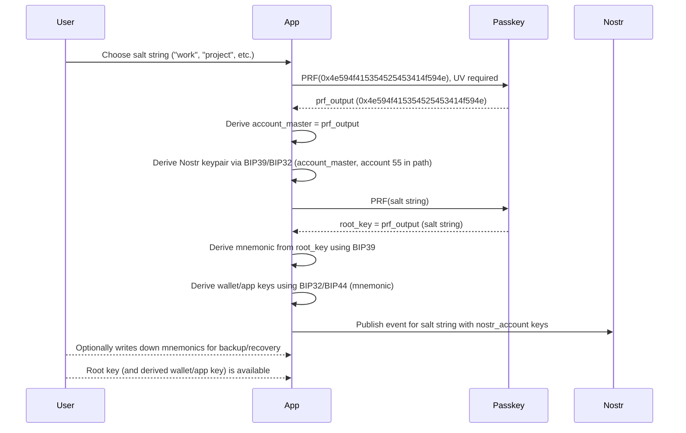
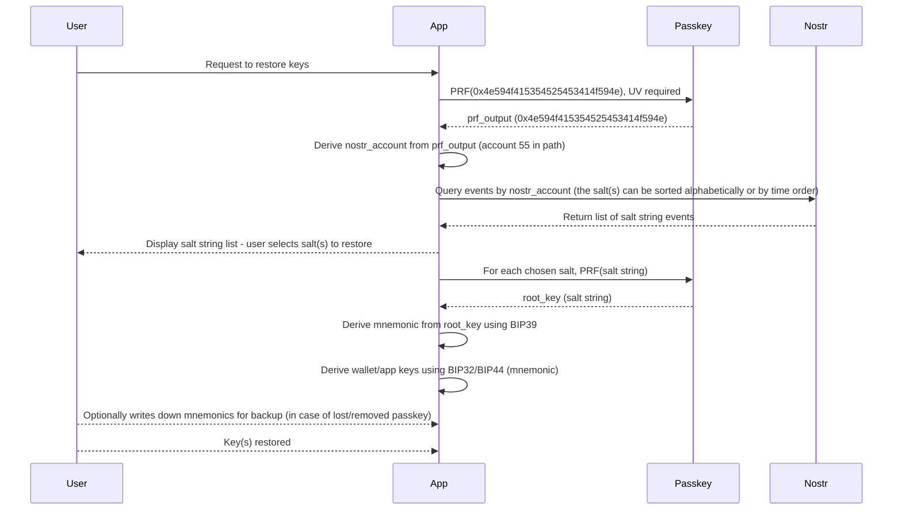

# Passkey-Derived Deterministic Key Generation via PRF and Nostr Salt Lookup – v0.9.1

## 1. Purpose

This specification defines a **stateless**, **passkey-anchored**, **deterministic key-generation mechanism** using the **PRF extension of WebAuthn**.

It enables applications to derive stable root keys from:
- a **WebAuthn passkey** (with PRF extension, UV-protected)
- one or more **salt strings, which may be meaningful**, stored publicly on Nostr

No seed phrase, backup, server-side state, or cloud storage is required.  
Any device that can authenticate via passkey+PRF can reconstruct root keys.

From each **root key** (derived per salt), **BIP39/BIP32 is applied** to create the mnemonics and deterministic key hierarchies that can be used in wallets and compatible apps.  
Optionally, users can **write down the mnemonic phrase** derived from a root key for backup/recovery in case the passkey is lost or removed.

## 2. Definitions

| Term                | Meaning                                                                                                    |
|---------------------|-----------------------------------------------------------------------------------------------------------|
| **Passkey**         | A WebAuthn credential supporting PRF extension and user verification.                                     |
| **prf_key**         | Output from PRF(passkey, challenge).                                                                      |
| **salt**            | *String which can be meaningful* (e.g. "work", "project", etc.) <br>No additional random string is ever added to the salt.|
| **account_master**  | Secret for BIP39/Nostr keys, obtained via PRF(passkey, `0x4e594f415354525453414f594e`).                  |
| **nostr_account**   | Nostr keypair, BIP39-derived, using account 55 in the BIP32 derivation path (`m/44'/1237'/55'/0/0`), as specified in NIP-06.   |
| **root_key**        | Derived via PRF(passkey, salt) for each salt string.                                                      |
| **mnemonic**        | BIP39 mnemonic phrase representing a root key.                                                            |
| **wallet/app keys** | Keys derived from root key(s) using BIP39/BIP32, usable by compatible wallet and app systems.             |

**Reference:**  
- [BIP39 - Mnemonic Code for Generating Deterministic Keys](https://github.com/bitcoin/bips/blob/master/bip-0039.mediawiki)
- [BIP32 - Hierarchical Deterministic Wallets](https://github.com/bitcoin/bips/blob/master/bip-0032.mediawiki)
- [BIP44 - Multi-Account Hierarchy for Deterministic Wallets](https://github.com/bitcoin/bips/blob/master/bip-0044.mediawiki)
- [NIP-06 - Nostr Key Derivation](https://github.com/nostr-protocol/nips/blob/master/06.md)

**Derivation Paths:**

- Salt Registry Account (Publishing/Restoring Salts):  
  `m/44'/1237'/55'/0/0`
- Regular Nostr Account (General Usage):  
  `m/44'/1237'/0'/0/0`
- **Wallet/App Keys:**  
  Derived using BIP39/BIP32 from each salt-derived root key.

## 3. High-Level Architecture

- **Client Application**
  - Performs WebAuthn PRF operations
  - Publishes/reads salt messages on Nostr using the Salt Registry Account
  - Applies BIP39/BIP32 on derived root keys to generate mnemonics and key hierarchies
  - Allows users to optionally export or write down mnemonics for backup/recovery
  - No local secret storage needed

- **Passkey Authenticator**
  - Secure enclave/HSM supporting PRF extension
  - Enforces biometric or device PIN for User Verification (UV)

- **Nostr Relays**
  - Store one event per salt string, signed by nostr_account

## 4. Core Idea

```
account_master = PRF(passkey, 0x4e594f415354525453414f594e)
nostr_account = BIP39/Nostr keys derived from account_master (using account 55 in path: m/44'/1237'/55'/0/0)
For each salt string, root_key = PRF(passkey, salt)
For each root_key, mnemonic = BIP39(root_key)
For each mnemonic, wallet/app keys = BIP32/BIP44(mnemonic)
Each salt string is published in its own Nostr event via nostr_account
User may choose to record/write down mnemonic for backup
```

*Where `0x4e594f415354525453414f594e` is the hexadecimal encoding of the "magic" string "NYOASTRTSAOYN", specifically chosen for the account master PRF challenge to prevent collision with any salt values.*

*Although in many cryptographic applications it is best practice to use a random salt, in this scheme—where the derived values are not used directly as symmetric keys and are not shared—we only require the salt to be unique. The protocol offers the possibility for the salt to be meaningful. No random text is appended, ensuring determinism and maximising memorable recovery.*

## 5. Sequence Diagrams

### 5.1 Initial Creation



### 5.2 Restore



## 6. Passkey PRF Usage

### 6.1 Account Master

```
account_master = PRF(passkey, 0x4e594f415354525453414f594e)
nostr_account = Nostr keys derived from account_master at account 55 in the BIP39/BIP32/NIP-06 derivation path (m/44'/1237'/55'/0/0)
```

### 6.2 Root Key & Mnemonic Derivation

For every salt string:

```
root_key = PRF(passkey, salt_string)
mnemonic = BIP39(root_key)
wallet/app keys = BIP32/BIP44(mnemonic)
```

*The salt_string may be meaningful.*

*No extra random text is added to any salt string, guaranteeing stable, memorable, and Nostr-publishable salts.*

*The mnemonic phrase is deterministically derived from the root key and can be optionally recorded by the user as an alternative recovery or backup method.*

## 7. Salt Publication

- **One Nostr event per salt string, published as a regular message (kind 1)**
- Signed using nostr_account keys (derived at account 55)
- **The salt string is placed in the `content` field**, making it indistinguishable from any ordinary user message
- No need for randomness, base64, encryption, or special formatting
- Salt is public, and deterministic—never randomized or appended with extra entropy, so salts can be remembered and/or saved to Nostr
- Salt determinism is crucial for both nostr account derivation and user experience

**Plausible Deniability:**  
By publishing salts as standard kind-1 text events, salts look just like regular Nostr messages. There is no explicit indication these are connected to seeds, keys, or wallets, maximizing plausible deniability.

### 7.1 Event Kind

Use:

```
kind = 1
```

### 7.2 Message Format and Example

```json
{
  "kind": 1,
  "pubkey": "<hex-encoded-pubkey>",
  "created_at": 1730000000,
  "content": "<salt_string>",
  "sig": "<event-signature>"
}
```

Example:

```json
{
  "kind": 1,
  "pubkey": "abcdef...",
  "created_at": 1730000000,
  "content": "project1",
  "sig": "deadbeef..."
}
```

## 8. Initialization (Write Path)

1. Obtain account_master via PRF(0x4e594f415354525453414f594e)
2. Derive nostr_account keys (account 55 in derivation path: m/44'/1237'/55'/0/0)
3. Choose salt string (no additional random text appended), which may be meaningful
4. Compute root_key = PRF(passkey, salt_string)
5. Derive mnemonic from root_key using BIP39
6. Derive wallet/app keys from mnemonic using BIP32/BIP44
7. Optionally, user writes down the mnemonic for recovery
8. Publish a Nostr kind-1 event where the content is the salt string, signed by nostr_account

## 9. Regeneration (Read Path)

1. Obtain `account_master` via PRF(0x4e594f415354525453414f594e)
2. Derive `nostr_account` from `account_master` (at account 55 in the derivation path: m/44'/1237'/55'/0/0)
3. Query Nostr for kind-1 events published by `nostr_account` (the salt(s) can be sorted alphabetically or by time order)
4. **Display the list of salt strings to the user; let the user select which salt(s) to restore**
5. For each selected salt string:
    - Compute `root_key = PRF(passkey, salt_string)`
    - Derive `mnemonic` from root_key using BIP39
    - Derive wallet/app keys using BIP32/BIP44
    - Optionally display mnemonic for backup/recording
6. Present the restored root key(s) and wallet/app keys to the user or continue downstream logic

## 10. Adding/Listing Salts

- New salt strings can be added anytime; each published as a new Nostr kind-1 event
- List salts by querying kind-1 events from nostr_account

## 11. Security Properties

- Fully stateless; no local secret storage
- Passkey with PRF is sole trust anchor; secrets never leave hardware
- Salts are public, and deterministic—never randomized or appended, guaranteeing determinism
- Salt strings do **not** need to be memorized or manually saved; they are always recoverable from Nostr events published by the user's nostr account
- Events use standard kind-1 formats for plausible deniability, not betraying any relation to seeds or cryptographic secrets
- Optionally, users may record mnemonic phrases for recovery in case passkey is lost/removed
- Once CXP/CXF (Cross-Platform/Cloud Export Format) is implemented by all cloud-synced providers, users will be able to switch providers easily and seamlessly
- Relay compromise—no effect
- No need for rotation: salts and Nostr keys are persistent
- Account at `m/44'/1237'/0'/0/0` (account 0) can be used by Nostr apps for regular identity and messaging keypairs, as per NIP-06

## 12. Limitations

- Lost passkey = lost root keys, unless user has written down/recorded mnemonic(s)
- Cloud-synced passkey compromise = compromise of all associated keys

## 13. Summary

Deterministic key generation using WebAuthn PRF:

- Generate account_master with PRF(0x4e594f415354525453414f594e), derive Nostr keys at account 55 (`m/44'/1237'/55'/0/0`)
- For each salt string, compute root_key = PRF(passkey, salt_string)
- From each root_key, derive mnemonic using BIP39
- From mnemonic, derive wallet/app keys using BIP32/BIP44 for use by compatible wallets and applications
- **No random string is ever added to salts—ensuring deterministic derivation from passkey for both the nostr account and per-salt keys**
- Salt publication events use standard kind-1 formats for plausible deniability
- Publish one Nostr kind-1 event per salt string
- Salt strings are always recoverable from Nostr events published by nostr_account
- Restore keys by replaying PRF with selected salt strings from the event list and applying BIP39/BIP32/BIP44
- Optionally, user may backup mnemonics for additional recovery

```
Passkey + PRF(0x4e594f415354525453414f594e) --> account_master --> Nostr keys (account 55 at m/44'/1237'/55'/0/0)
Passkey + PRF(salt string) --> root_key --> BIP39 mnemonic --> BIP32/BIP44 wallet/app keys
Nostr keys --publish--> Salt String Events (kind 1)
App --present salt list--> User --choose--> Restore Specific Key(s)
User [optionally] --write down--> Mnemonics for backup/recovery
```
